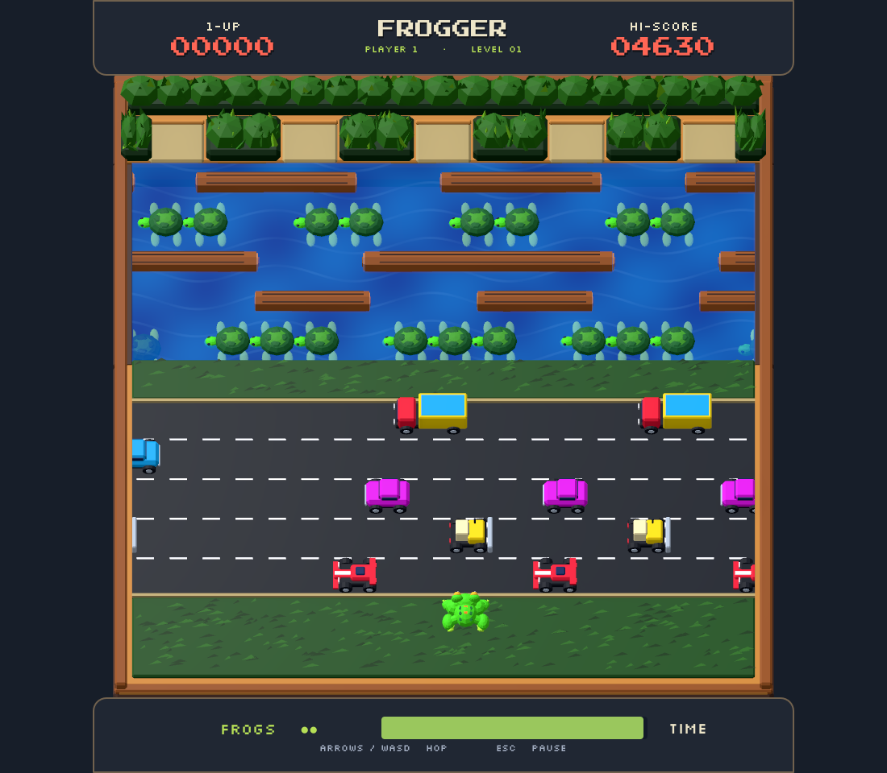

# Frogger Remake

A native C# / Godot 4.7 remake of the supplied **1981 Konami arcade Frogger** set. The original main and sound programs are statically translated into C#; Godot renders an animated low-poly world made in Blender. No browser or JavaScript interpreter ships in the game.



## Play

Open **`godot/project.godot`** in Godot 4.7 **.NET**, build C#, and press **F5**. Or run:

```powershell
./RunGame.ps1
```

Arrow keys, WASD, or a controller D-pad/left stick move the frog. Each press makes one hop; release before pressing again. Enter/Space starts a one-player game; controller A also starts or restarts after game over. `1` / `2` start one or two players; two players take alternating turns. Escape/P pauses, R restarts, M toggles sound, F11 toggles fullscreen, and C/5 inserts a coin. The game starts fullscreen with perspective and follow camera enabled. **Classic collision** is optional; the default road contact uses actual Blender model bounds and checks movement between frames. The river crocodile's visible back is aligned with the ROM's safe support area in both modes; its head remains lethal. Modern collision also handles back contact across the byte-coordinate wrap. Older preference files receive these defaults once, then new choices persist. Other river supports and game rules remain in the recovered program.

Both starting grass rows are walkable, including the ROM's lower row at `0xF0`. Grass uses separated, flat low-poly marks; a thick rear hedge stands behind the open home bays. The blue river has continuous animated ripples and a deep translucent layer over partly submerged turtles and detailed tapered logs. River and home gators share the sculpted upper jaw and rig; the river variant has its head aligned to both ROM bite branches and a stable rideable back, while the home variant has a visible curled tail and retreats into the hedge when its ROM tile clears. Snakes have a continuous segmented body and face their actual travel direction. The pink frog remains visible and seated on the logs when the original ROM's fly-bonus bug blanks her sprite but leaves her pickup active. The frog and moving objects interpolate between native pixel positions without changing gameplay. A home arrival finishes its last hop and remains visible for 0.25 seconds unless movement input resumes immediately. Bonus points stay at their screen position during camera movement; the time bonus appears in an upper-screen centered banner. Lighting includes top-left sun, soft shadows and ambient occlusion. The top and bottom HUD panels meet the screen edges and round toward the board; gameplay remains visible outside the rounded top panel in follow mode. The cursor is hidden during play and visible in menus.

## First checkout

Requirements: Godot 4.7 .NET, .NET 10 SDK, and Python 3.10+. Put the user-supplied `frogger.zip` in `reference/`, then:

```powershell
./tools/setup.ps1
```

The setup verifies the exact ROM set, prepares local data, regenerates native C#, imports assets and builds the project. It never downloads a ROM. `GODOT_EXE` can override executable discovery; on this machine Godot is in `C:\GameDev\Godot_v4.7-stable_mono_win64`.

The checked-in GLBs need no Blender installation to play. To regenerate them, install Blender 5.1+, set `BLENDER_EXE` if necessary, and run `./tools/setup.ps1 -RebuildModels`. Editable source files are in `art/source/`; the reproducible recipe is `art/scripts/build_assets.py`.

For a private Windows build, install Godot's matching .NET export templates and run `./BuildGame.ps1`. The output is under `builds/windows/`. The build includes your local ROM data and is not a ROM-free distribution.

## Web version

Use Godot 4.7 **Standard** and its matching export templates, Emscripten 4.0.20,
and SCons, then run:

```powershell
./BuildWeb.ps1
./RunWeb.ps1
```

Open `http://localhost:8080/index.html`. The standard web build is non-threaded,
including its C++ GDExtension, and uses the browser's Web Audio output for live
ROM audio. It needs no SharedArrayBuffer or cross-origin isolation headers.
Any ordinary local HTTP server works, including
`python -m http.server 8080 --directory builds/web`. Opening `index.html` directly
with `file://` is not supported.

For hosting, upload the **contents** of `builds/web/`, with `index.html` at the
root and every supporting file included, and serve over HTTPS. This also
applies to CrazyGames uploads. `DeployWeb.ps1` publishes to Cloudflare Pages;
the generated `_headers` only controls entry-page/service-worker caching.
See [Web audio](docs/WEB_AUDIO.md) for audio diagnostics.

The iOS Home Screen app uses `viewport-fit=cover` and Apple's
`black-translucent` status-bar mode for an edge-to-edge canvas. Portrait iOS
does not add safe-area padding; landscape still protects sidebar controls from
the notch. Android retains its safe-area handling, including the bottom inset.

Web builds losslessly gzip the large `.wasm` and `.pck` assets into `.bin`
payloads. The generated loader decompresses them in the browser, so no server
`Content-Encoding` configuration is needed. Upload those `.bin` files and
`frogger-compression.js` along with the rest of the output; do not rename them
or upload additional uncompressed copies. `BuildWeb.ps1` reports the complete
upload size and warns if it exceeds the 20 MB CrazyGames mobile size target.
This uses the standard gzip `DecompressionStream` API (Safari/iOS 16.4+,
Chrome/Edge 80+, Firefox 113+).

## How fidelity is checked

This project separates **decompilation**, **native translation**, and **behavior verification**. A generated function or a successful Ghidra exit is not, by itself, a proof of gameplay parity.

- Ghidra disassembles both CPUs and exports C, an instruction listing, a call inventory and explicit computed-dispatch seeds.
- The pinned, GPL-licensed [arcade-js Frogger recovery](https://github.com/qarl/arcade-js/tree/9387bbe817befacc235cd8f9f4dd56c652172481/games/frogger) supplies readable function-level references and independent regression fixtures. It is test/reference material, not the runtime.
- `tools/recompile.py` lowers the supplied bytes into compiled C# arithmetic, calls, branches and memory operations. Original address labels, byte wrapping, BCD scores, instruction timing and interrupt order are retained. There is no runtime opcode decoder or interpreter fallback.
- A 460-frame native run matches the frozen reference across **1,530,880 bytes**, with zero differences and no masked RAM. Eight separately captured **MAME 0.289** function executions match both RAM and registers.
- The coverage audit checks source hashes, every recovered main entry, actual Ghidra instruction presence, nonempty C output, generated-code provenance, parity reports and Blender export validation.

Run the complete local gate (Node 24+ and Pillow are also required for the verification tools):

```powershell
./tools/verify.ps1
./tools/decompile.ps1   # re-run Ghidra; requires Ghidra + Java 21
```

See [the decompilation and verification notes](docs/DECOMPILATION.md), [machine-readable audit](docs/evidence/audit.json), [function map](docs/evidence/function-map.json), and [asset validation](docs/evidence/asset-validation.json).

The native port is a faithful address-level translation, **not a completed handwritten, idiomatic C# rewrite**. The tests cover specific executions; they do not establish universal equivalence across every possible state. Model-sized road contact is a deliberate frontend option outside the recovered instruction bodies; Classic collision executes the original road routine. Held movement goes directly to the ROM's one-hop-until-release latch, with stick hysteresis to prevent accidental retriggers. The sound CPU executes the recovered program, while the AY output stage uses a native synthesis model rather than MAME's exact analogue netlist.

## Files and licensing

`godot/` contains the actual game. `tools/` contains reproducible import, reverse-engineering and verification tools. `vendor/arcade-js/` is the checksum-pinned GPL-3.0-only reference; its license and attribution are retained. Fonts carry their own SIL OFL licenses in `godot/Fonts/`. See [THIRD_PARTY.md](THIRD_PARTY.md).

Git ignores `reference/`, prepared ROMs, Godot's `.godot/` and `.mono/` caches, C# build output, export credentials, build products and Blender backups. Project files, scenes, `.uid` identities, `.import` settings, C# sources, Blender sources and exported models remain tracked.
